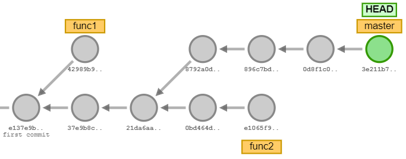
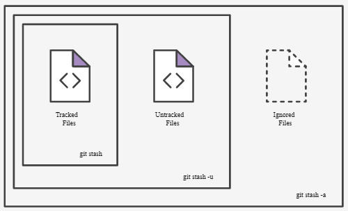

# Branch

O Branch, do inglês ramificação, permite trabalhar paralelamente em outros versões de código. Na linha de desenvolvimento o código funcional, testado e validado, está armazenado em uma branch, normalmente chamada de main. Quando é necessário fazer alguma correção ou implementar uma nova funcionalidade é criado um novo branch, que herda todas as informações da main. As alterações realizadas não afetam o código da main. O desenvolvimento é realizado na nova branch e depois de finalizado e testado é mesclado com o código principal. 

 <figure>
    
    <figcaption>Figura - Ramificações Git</figcaption>
  </figure> 

HEAD é um nome simbólico para o commit atualmente ativo (que sofreu checkout por último).

Mover-se pela árvore do Git especificando o hash do commit pode se tornar um pouco entediante. No mundo real, você não terá à sua disposição essa bonita visualização da árvore ao lado do seu terminal, então você terá de usar o comando git log para ver os hashes. O que salva é que o Git é inteligente com os hashes. Ele só exige que você especifique a quantidade de caracteres do hash suficiente para identificar unicamente o commit. Então eu posso digitar apenas fed2 em vez da grande string acima.

__OBS:__ o Git só cria o Branch após o primeiro commit. As operações com branch só serão efetivadas após o primeiro commit. Erro gerado ao tentar criar novo branch antes do primeiro commit: __fatal: not a valid object name: 'main'__

Comandos:  
__Renomear #1:__ para alterar o nome da branch atual
    
    $ git branch -m <novo-nome>

__Renomear #2:__ para alterar o nome fora da branch  

    $ git branch -m <nome-atual> <novo-nome>

__Criar:__
    $ git branch <nome-da-nova-branch>

__Visualizar:__ o branch atual aparece marcado com o símbolo *.

    $ git branch

__Mudar:__ Trocar de branch

    $ git checkout <nome-branch>

__Criar e mudar__:

    $ git checkout -b <nome-branch>

__Apagar__: o branch atual aparece marcado com o símbolo *.

    $ git branch --delete <nome-branch>
    $ git branch -d <nome-branch>

OBS: O branch é criado a partir do branch atual.

__Unir:__ o branch <nome-branch> será unido com o branch atual.

    $ git merge <nome-branch>

Para ver o último commit em cada branch, você pode executar:

__Filtros:__  
mostrar último commit no branch

    $ git branch -v

- As opções --merged e --no-merged podem filtrar esta lista para branches que você tem ou ainda não mesclou no branch em que está atualmente. Para ver quais branches já estão mesclados no branch em que você está, você pode executar:

        $ git branch --merged:

## Git merge e git rebase

Há duas maneiras principais de desfazer mudanças no Git -- uma delas é usando git reset, e a outra é usando git revert.

__Git Reset:__  
O comando git reset reverte mudanças movendo para trás no tempo (para um commit mais antigo) a referência do ramo. Desta forma, você pode pensar nessa operação como uma "reescrita do histórico"; o git reset vai mover o ramo para trás como se o commit nunca tivesse existido.

Embora o reset funcione muito bem em ramos locais no seu próprio computador, o método utilizado de "reescrever o histórico" não funciona com ramos remotos que outras pessoas estejam usando.

Git reset - manipula a localização dos arquivos. Flags:   
--soft: move os arquivos para stage, antes de fazer o commit;  
--midex: move os arquivos para diretório de trabalho;  
--hard: remove os arquivos.  

__Git Revert__  
No Git revert não há perda do histórico. O Git inverte as alterações com relação ao arquivo anterior e cria um novo commit, mantendo o histórico do projeto.

Git revert - manipula os commits. Não possui flags.

    $ git revert HEAD~1
    $ git revert 8fs7lxc1

## Git Stash  
Referência: https://www.atlassian.com/br/git/tutorials/saving-changes/git-stash

O Git stash arquiva as alterações não comitadas do diretório de trabalho e da área de stage. Ele não salva as alterações dos arquivos não rastreados e nem dos arquivos ignorados. O stash é útil para mudar de branch, ou alternar o que esteja trabalhando e que não está pronto para ser commitado, sem precisa fazer o commit.

Comando para armazenar: O comando Git stash salva as alterações sem commit.

    $ git stash

Comando para aplicar um as alterações armazenadas pelo comando stah. Remova da lista de stash o último armazenamento realizado.

    $ git stash pop

Para reaplicar as alterações do último stash sem removê-la da lista de stash. É utilizado quando se quer aplicar a mesma alterações em outros branchs:

    $ git stash aplly

OBS: não pode trocar de branch sem que as alterações, do diretório de trabalho ou stage, estejam salvas(comitadas)

Para incluir arquivos não rastreados:

    $ git Stash -u

Para incluir todos os arquivos:

    $ git Stash -a

 <figure>
    
    <figcaption>Figura - Git Stash Flags</figcaption>
  </figure> 

  Para visualizar a lista de stash:

    $ git stash list

Por padrão os stashes são identificados como Eork in progress (WIP). Pode ser difícil lembrar o significado de cada stash. Por isso é uma boa prática nomear os stashes:

    $ git stash save "mensagem"

Por padrão o stash pop reaplica o último stash.Para reaplicar determinado stash pode-se utilizar. O stash mais atual é o de número 0:

    $ git stash pop stash@{2}

Criar uma remificação com os arquivos do stash:

    $git stash branch <nome-branch> stash@{1}

Apagar um stash específico:

    $ git stash drop stash@{1}

Para limpar todos os stashes:

    $ git stash clear

# Referências
https://learngitbranching.js.org/?locale=pt_BR
https://git-school.github.io/visualizing-git/