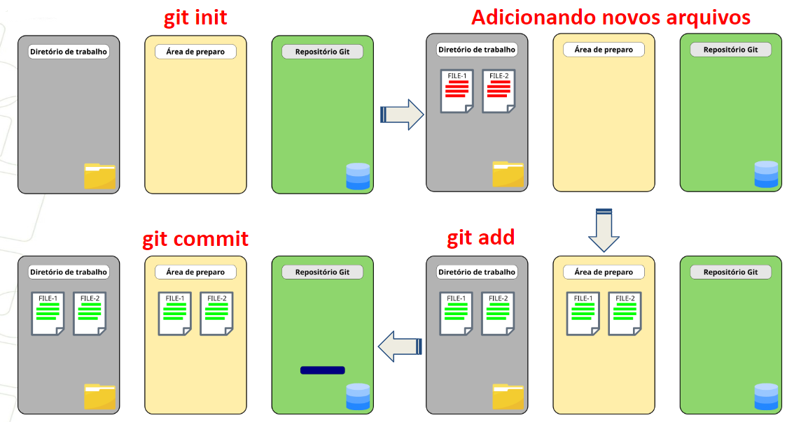
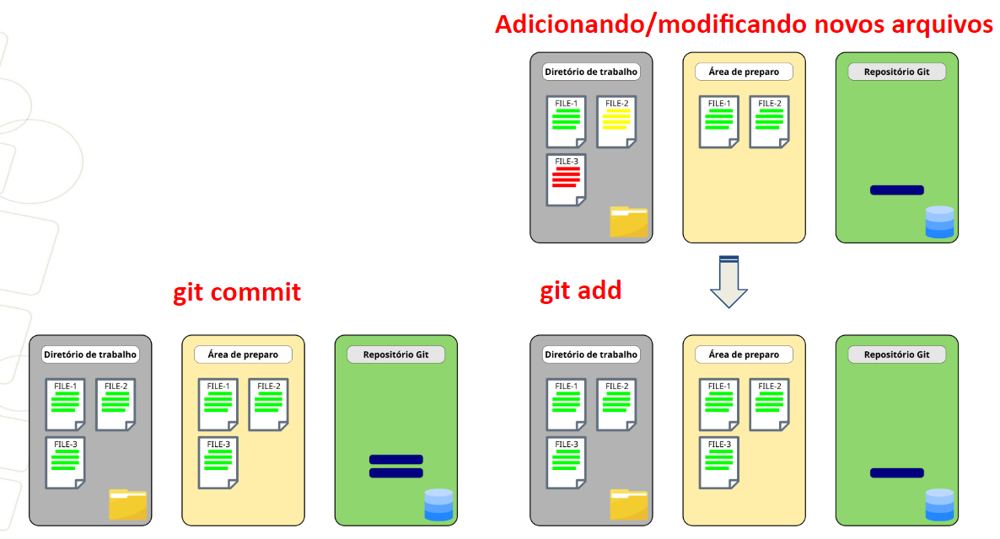
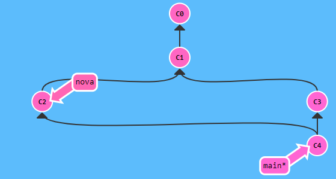

# Roteiro

## CONFIGURAÇÕES INICIAIS DO GIT
---

> ✍️ **_HORA DE PRATICAR_**: configurar o GIT com o nome e email do usuário.  

Para acessar o conteúdo completo [clique aqui](docs/git/configuracores-iniciais-git.md).

## FLUXO GIT
---
Para acessar o conteúdo completo [clique aqui](docs/git/fluxo-trabalho-basico-git.md).

> ✍️ **_HORA DE PRATICAR_**: Fluxo de trabalho Git. Dica: Ir mostrando os passos com o git status e deixar a janela aberta lado a lado;

### Prática #1:

Na figura é apresentado o fluxo de trabalho que será realizado no exercício. Os arquivos em vermelho representam arquivos não rastreados. Arquivos em verde são os arquivos não modificados.

 <figure>
    
    <figcaption>Figura - Prática Fluxo Git</figcaption>
  </figure> 

1) Criar repositório;
2) Criar dois arquivos no repositório, por exemplo, lasanha-frango e bolo-cenoura (Pode ser utilizando o notepad++ ou o comando echo > nome-arquivo1 nome-arquivo2)
3) adicionar arquivos na área de preparo
4) fazer o commit

### Prática #2:

<figure>
    
    <figcaption>Figura - Prática Fluxo Git</figcaption>
</figure> 

1) Editar arquivo-2
2) incluir arquivo-3
3) adicionar arquivos para área de preparo
4) OPCIONAL: editar novamente arquivo-2. Agora o arquivo 2 vai estar em dois estados: preparado e modificado
5) adicionar arquivos na área de preparo
6) fazer o commit

## GIT Branch:
Para acessar o conteúdo completo [clique aqui](docs/git/branch.md).

> ✍️ **_HORA DE PRATICAR_**: Git Branch. Para ilustrar o que acontece com a branch pode-se utilizar [este link](https://learngitbranching.js.org/?locale=pt_BR) ou [este link](https://git-school.github.io/visualizing-git/). 

### Prática #1 usando [visualizador](https://learngitbranching.js.org/?locale=pt_BR):  

<figure>
    
    <figcaption>Figura - Prática Branch Git</figcaption>
</figure> 

1) Criar um novo branch para adicionar uma nova receita (ex: nova);
2) Mudar para a nova branch
3) fazer novo commit (ou mais do que 1 commit) na nova branch
4) voltar para o braço principal
5) fazer commit na main (ou mais do que 1 commit)
6) merge

### Prática #2:  
1) Criar um novo branch para Correção da receita;
2) Editar arquivo na mesma linha do branch principal;
3) fazer o merge.
4) Resolver conflitos
